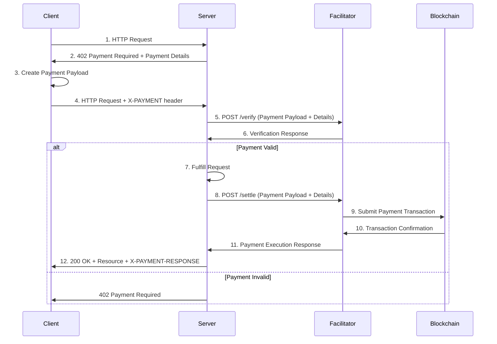

## What is a Facilitator?

The facilitator is an optional but recommended service that simplifies the process of verifying and settling payments between clients (buyers) and servers (sellers).

The facilitator is a service that:

- **Verifies payment payloads** submitted by clients
- **Settles payments** on the blockchain on behalf of servers

By using a facilitator, servers do not need to maintain direct blockchain connectivity or implement payment verification logic themselves. This reduces operational complexity and ensures accurate, real-time validation of transactions.

<Info>
  The facilitator does not hold funds or act as a custodian - it performs
  verification and execution of onchain transactions based on signed payloads
  provided by clients.
</Info>

## Facilitator Responsibilities

<CardGroup cols={2}>
  <Card title="Verify Payments" icon="shield">
    Confirm that the client's payment payload meets the server's declared
    payment requirements
  </Card>
  <Card title="Settle Payments" icon="coins">
    Submit validated payments to the blockchain and monitor for confirmation
  </Card>
  <Card title="Provide Responses" icon="arrow-left">
    Return verification and settlement results to the server, allowing the
    server to decide whether to fulfill the client's request
  </Card>
  <Card title="Protocol Compliance" icon="check">
    Ensure standardized verification and settlement flows across services
  </Card>
</CardGroup>

## Why Use a Facilitator?

Using a facilitator provides several key benefits:

<AccordionGroup>
  <Accordion title="Reduced Operational Complexity" icon="cog">
    Servers do not need to interact directly with blockchain nodes or implement
    complex payment verification logic.
  </Accordion>

{" "}

<Accordion title="Protocol Consistency" icon="arrows-rotate">
  Standardized verification and settlement flows across services ensure reliable
  payment processing.
</Accordion>

{" "}

<Accordion title="Faster Integration" icon="bolt">
  Services can start accepting payments with minimal blockchain-specific
  development required.
</Accordion>

  <Accordion title="Real-time Validation" icon="clock">
    Accurate, real-time validation of transactions without maintaining
    blockchain infrastructure.
  </Accordion>
</AccordionGroup>

<Note>
  While it is possible to implement verification and settlement locally, using a
  facilitator accelerates adoption and ensures correct protocol behavior.
</Note>

## Interaction Flow

The following diagram shows how clients, servers, and facilitators interact in the x402 protocol:

### Step-by-Step Breakdown

1. **Client** makes an HTTP request to a **resource server**
2. **Resource server** responds with a `402 Payment Required` status and payment details
3. **Client** creates a payment payload based on the selected payment scheme
4. **Client** sends the request with `X-PAYMENT` header containing the payment payload
5. **Resource server** verifies the payment via the facilitator's `/verify` endpoint
6. **Facilitator** performs verification and returns a verification response
7. If valid, the **resource server** fulfills the request
8. **Resource server** settles payment via the facilitator's `/settle` endpoint
9. **Facilitator** submits the payment to the blockchain
10. **Facilitator** waits for blockchain confirmation
11. **Facilitator** returns execution response to the server
12. **Resource server** returns the requested resource with settlement details