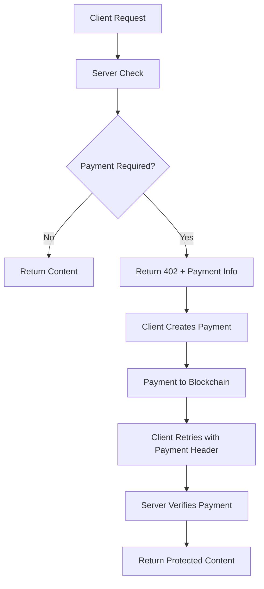

# x402 Protocol Overview

x402 transforms any HTTP endpoint into a paid service using blockchain micropayments. Originally designed as an extension to HTTP status codes, X402 enables seamless monetization of APIs, content, and digital services.

## Core Components

<CardGroup cols={2}>
  <Card title="402 Status Code" icon="shield-check">
    **HTTP Payment Required** Standard HTTP status indicating payment is needed
    to access the resource.
  </Card>
  <Card title="Payment Headers" icon="list">
    **X-402-Payment Headers** Cryptographic proof of payment embedded in HTTP
    requests.
  </Card>
</CardGroup>

<CardGroup cols={2}>
  <Card title="Facilitators" icon="server">
    **Payment Processors** Server-side components that handle payment
    verification and enforcement.
  </Card>
  <Card title="Clients" icon="desktop">
    **Payment Makers** Client libraries that automatically handle payment
    creation and retry logic.
  </Card>
</CardGroup>

## How x402 Works

The protocol adds payment capabilities to standard HTTP by introducing payment headers and the `402 Payment Required` status code:

## Facilitators and Clients

The x402 ecosystem consists of two main types of components that work together to enable seamless micropayments:

**Facilitators** are server-side services that:
- Verify payment proofs from blockchain transactions
- Enforce payment requirements for protected resources
- Handle payment settlement and confirmation
- Provide APIs for payment status checking

**Clients** are libraries and tools that:
- Automatically detect 402 Payment Required responses
- Create and submit blockchain payments
- Retry requests with payment headers
- Manage wallet connections and user interactions

This separation allows developers to focus on their core business logic while the x402 infrastructure handles all payment complexity.

## Learn More

<CardGroup cols={2}>
    <Card title="Facilitators" href="/x402/facilitators/introduction" icon="server">
        Learn how to set up and configure payment processors
    </Card>
    <Card title="Client Integration" href="/x402/clients/fetch" icon="code">
        Integrate x402 payments into your applications
    </Card>
</CardGroup>
