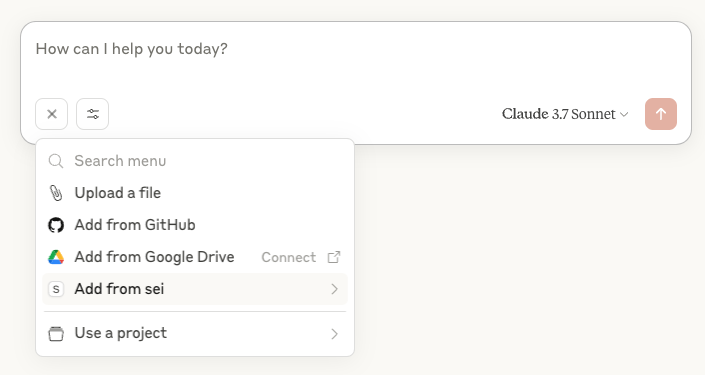
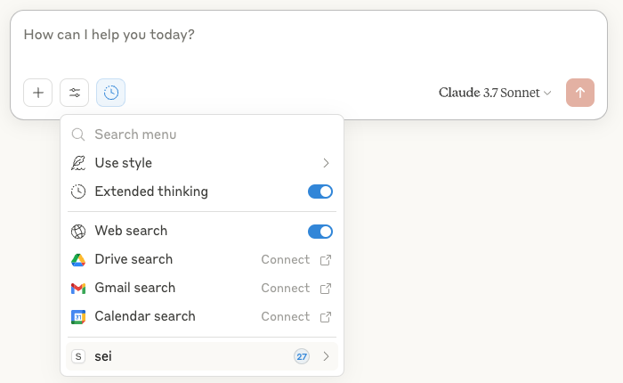
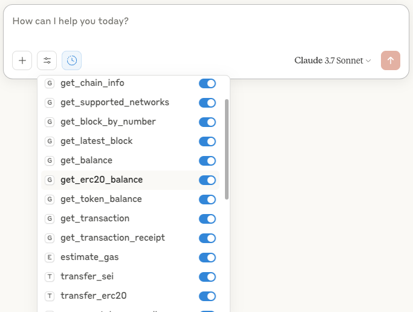

# SEI MCP Server


Sei Model Context Protocol (Sei MCP) server provides blockchain services for Sei blockchain. 
This server enables AI assistants and agents to interact via unified interface.

## 📋 Contents

- [Overview](#overview)
- [Features](#features)
- [Supported Networks](#supported-networks)
- [Prerequisites](#prerequisites)
- [Installation](#installation)
- [Server Configuration](#server-configuration)
- [Usage](#usage)
- [API Reference](#api-reference)
  - [Tools](#tools)
  - [Resources](#resources)
- [Security Considerations](#security-considerations)
- [Project Structure](#project-structure)
- [Development](#development)
- [License](#license)

## 🔭 Overview

The Sei MCP EVM Server leverages the Model Context Protocol to provide blockchain services to AI agents. 
It supports a wide range of services including:

- Reading blockchain state (balances, transactions, blocks, etc.)
- Interacting with smart contracts
- Transferring tokens (native, ERC20, ERC721, ERC1155)
- Querying token metadata and balances

All services are exposed through a consistent interface of MCP tools and resources, making it easy for AI agents to 
discover and use blockchain functionality.

## ✨ Features

### Blockchain Data Access

- **Chain information** including blockNumber, chainId, and RPCs
- **Block data** access by number, hash, or latest
- **Transaction details** and receipts with decoded logs
- **Address balances** for native tokens and all token standards

### Token services

- **ERC20 Tokens**
  - Get token metadata (name, symbol, decimals, supply)
  - Check token balances
  - Transfer tokens between addresses
  - Approve spending allowances

- **NFTs (ERC721)**
  - Get collection and token metadata
  - Verify token ownership
  - Transfer NFTs between addresses
  - Retrieve token URIs and count holdings

- **Multi-tokens (ERC1155)**
  - Get token balances and metadata
  - Transfer tokens with quantity
  - Access token URIs

### Smart Contract Interactions

- **Read contract state** through view/pure functions
- **Write services** with private key signing
- **Contract verification** to distinguish from EOAs
- **Event logs** retrieval and filtering

### Comprehensive Transaction Support

- **Native token transfers** across all supported networks
- **Gas estimation** for transaction planning
- **Transaction status** and receipt information
- **Error handling** with descriptive messages

## 🌐 Supported Networks

- Sei Mainnet
- Sei Testnet
- Sei Devnet

## 🛠️ Prerequisites

- [Bun](https://bun.sh/) 1.0.0 or higher
- Node.js 18.0.0 or higher (if not using Bun)

## 📦 Installation

```bash
# Clone the repository
git clone https://github.com/sei-protocol/sei-mcp-server.git
cd sei-mcp-server

# Install dependencies with Bun
bun install

# Or with npm
npm install
```

## ⚙️ Server Configuration

The server uses the following default configuration:

- **Default Chain ID**: 1329 (Sei Mainnet)
- **Server Port**: 3001
- **Server Host**: 0.0.0.0 (accessible from any network interface)

These values are hardcoded in the application. If you need to modify them, you can edit the following files:

- For chain configuration: `src/core/chains.ts`
- For server configuration: `src/server/http-server.ts`

### Environment Variables

The server supports loading configuration from environment variables:

- `PRIVATE_KEY`: **Required** private key for any blockchain operations that involve signing transactions (e.g., transferring tokens, interacting with smart contracts that modify state). This is the **sole method** for providing a private key. If this environment variable is not set when a transaction-signing tool is invoked, the tool will return an error message instructing the AI assistant to ask the user to set the `PRIVATE_KEY` environment variable and restart the MCP server.

Create a `.env` file in the root directory based on the `.env.example` template:

```bash
# .env.example
PRIVATE_KEY=your_private_key_here
```

> **SECURITY WARNING**: Never commit your actual private key to version control. The `.env` file is included in `.gitignore` by default.

## 🚀 Usage

### Using with Claude Desktop

1. Install the [Claude Desktop](https://claude.ai/download).
2. Go to Settings > Developer > Edit Config.
3. Add the following to the `mcpServers` section:
```json
{
  "mcpServers": {
    "sei": {
      "command": "npx",
      "args": [
        "-y",
        "@sei-protocol/sei-mcp-server"
      ],
      "env": {
        "PRIVATE_KEY": "your_private_key_here"
      }
    }
  }
}
```
4. Save the configuration file and restart Claude.
When done, Claude will add new prompts, resources and tools.
To access prompts, click "+" button in the bottom left corner. And then "Add from sei".



From there, click "Add from sei" to and for example, add a "my_wallet_address" prompt.
Claude should invoke now `get_address_from_private_key` tool and return the wallet address.
Sometimes, model may fail to understand tbe prompt or random question. Try to add a bit more context or retry with 
extensive thinking option.

All tools available could be found by clicking "Search And Tools" button and then "sei".





### Using npx (No Installation Required)

You can run the Sei MCP Server directly without installation using npx:

```bash
# Run the server in stdio mode (for CLI tools)
npx @sei-protocol/sei-mcp-server

# Run the server in HTTP mode (for web applications)
npx @sei-protocol/sei-mcp-server --http
```

### Running the Server Locally

Start the server using stdio (for embedding in CLI tools):

```bash
# Start the stdio server
bun start

# Development mode with auto-reload
bun dev
```

Or start the HTTP server with SSE for web applications:

```bash
# Start the HTTP server
bun start:http

# Development mode with auto-reload
bun dev:http
```

### Connecting to the Server

Connect to this MCP server using any MCP-compatible client. For testing and debugging, you can use the [MCP Inspector](https://github.com/modelcontextprotocol/inspector).

### Connecting from Cursor

To connect to the MCP server from Cursor:

1. Open Cursor and go to Settings (gear icon in the bottom left)
2. Scroll down to "MCP" section
3. Click "Add new Global MCP server"
4. In mcp.json tab add the following configuration

```json
{
  "mcpServers": {
    "sei-mcp-server": {
      "command": "npx",
      "args": [
        "-y",
        "@sei-protocol/sei-mcp-server"
      ],
      "env": {
        "PRIVATE_KEY": "your_private_key_here"
      }
    }
  }
}
```

### Example: HTTP Mode with SSE

If you're developing a web application and want to connect to the HTTP server with Server-Sent Events (SSE), you can use this configuration:

```json
{
  "mcpServers": {
    "sei-mcp-sse": {
      "url": "http://localhost:3001/sse"
    }
  }
}
```

This connects directly to the HTTP server's SSE endpoint, which is useful for:
- Web applications that need to connect to the MCP server from the browser
- Environments where running local commands isn't ideal
- Sharing a single MCP server instance among multiple users or applications

To use this configuration:
1. Create a `.cursor` directory in your project root if it doesn't exist
2. Save the above JSON as `mcp.json` in the `.cursor` directory
3. Restart Cursor or open your project
4. Cursor will detect the configuration and offer to enable the server(s)

### Example: Using the MCP Server in Cursor

After configuring the MCP server with `mcp.json`, you can easily use it in Cursor. Here's an example workflow:

1. Create a new JavaScript/TypeScript file in your project:

```javascript
// blockchain-example.js
async function main() {
  try {
    // Get Sei balance for an address
    console.log("Getting Sei balance for 0x1234...");
    
    // When using with Cursor, you can simply ask Cursor to:
    // "Check the Sei balance of 0x1234 on mainnet"
    // Or "Transfer 0.1 Sei from my wallet to 0x1234"
    
    // Cursor will use the MCP server to execute these operations 
    // without requiring any additional code from you
    
    // This is the power of the MCP integration - your AI assistant
    // can directly interact with blockchain data and operations
  } catch (error) {
    console.error("Error:", error.message);
  }
}

main();
```

2. With the file open in Cursor, you can ask Cursor to:

   - "Check the current Sei balance of 0x1234 on mainnet"
   - "Show me the latest block on Sei"
   - "Check if 0x1234... is a contract address"

3. Cursor will use the MCP server to execute these operations and return the results directly in your conversation.

The MCP server handles all the blockchain communication while allowing Cursor to understand and execute blockchain-related tasks through natural language.

### Connecting using Claude CLI

If you're using Claude CLI, you can connect to the MCP server with just two commands:

```bash
# Add the MCP server
claude mcp add evm-mcp-server npx @sei-protocol/sei-mcp-server

# Start Claude with the MCP server enabled
claude
```

### Example: Getting a Token Balance

```javascript
// Example of using the MCP client to check a token balance
const mcp = new McpClient("http://localhost:3000");

const result = await mcp.invokeTool("get-token-balance", {
  tokenAddress: "0x3894085ef7ff0f0aedf52e2a2704928d1ec074f1", // USDC on Sei
  ownerAddress: "0xd8dA6BF26964aF9D7eEd9e03E53415D37aA96045", 
  network: "sei"
});

console.log(result);
// {
//   tokenAddress: "0x3894085ef7ff0f0aedf52e2a2704928d1ec074f1",
//   owner: "0xd8dA6BF26964aF9D7eEd9e03E53415D37aA96045",
//   network: "sei",
//   raw: "1000000000",
//   formatted: "1000",
//   symbol: "USDC",
//   decimals: 6
// }
```

## 📚 API Reference

### Tools

The server provides the following MCP tools for agents. 

#### Token services

| Tool Name | Description | Key Parameters |
|-----------|-------------|----------------|
| `get-token-info` | Get ERC20 token metadata | `tokenAddress` (address), `network` |
| `get-token-balance` | Check ERC20 token balance | `tokenAddress` (address), `ownerAddress` (address), `network` |
| `transfer-token` | Transfer ERC20 tokens | `tokenAddress` (address), `toAddress` (address), `amount`, `network` |
| `approve-token-spending` | Approve token allowances | `tokenAddress` (address), `spenderAddress` (address), `amount`, `network` |
| `get-nft-info` | Get NFT metadata | `tokenAddress` (address), `tokenId`, `network` |
| `check-nft-ownership` | Verify NFT ownership | `tokenAddress` (address), `tokenId`, `ownerAddress` (address), `network` |
| `get-nft-balance` | Count NFTs owned | `tokenAddress` (address), `ownerAddress` (address), `network` |
| `get-erc1155-token-uri` | Get ERC1155 metadata | `tokenAddress` (address), `tokenId`, `network` |
| `get-erc1155-balance` | Check ERC1155 balance | `tokenAddress` (address), `tokenId`, `ownerAddress` (address), `network` |
| `transfer-erc1155` | Transfer ERC1155 tokens | `tokenAddress` (address), `tokenId`, `amount`, `toAddress` (address), `network` |

#### Blockchain services

| Tool Name         | Description | Key Parameters |
|-------------------|-------------|----------------|
| `get-chain-info`  | Get network information | `network` |
| `get-balance`     | Get native token balance | `address` (address), `network` |
| `transfer-sei`    | Send native tokens | `to` (address), `amount`, `network` |
| `get-transaction` | Get transaction details | `txHash`, `network` |
| `read-contract`   | Read smart contract state | `contractAddress` (address), `abi`, `functionName`, `args` (optional), `network` |
| `write-contract`  | Write to smart contract | `contractAddress` (address), `abi`, `functionName`, `args` (optional), `network` |
| `is-contract`     | Check if address is a contract | `address` (address), `network` |

### Resources

The server exposes blockchain data through the following MCP resource URIs.

#### Blockchain Resources

| Resource URI Pattern | Description                              |
|-----------|------------------------------------------|
| `evm://{network}/chain` | Chain information for a specific network |
| `evm://chain` | Sei mainnet chain information            |
| `evm://{network}/block/{blockNumber}` | Block data by number                     |
| `evm://{network}/block/latest` | Latest block data                        |
| `evm://{network}/address/{address}/balance` | Native token balance                     |
| `evm://{network}/tx/{txHash}` | Transaction details                      |
| `evm://{network}/tx/{txHash}/receipt` | Transaction receipt with logs            |

#### Token Resources

| Resource URI Pattern | Description |
|-----------|-------------|
| `evm://{network}/token/{tokenAddress}` | ERC20 token information |
| `evm://{network}/token/{tokenAddress}/balanceOf/{address}` | ERC20 token balance |
| `evm://{network}/nft/{tokenAddress}/{tokenId}` | NFT (ERC721) token information |
| `evm://{network}/nft/{tokenAddress}/{tokenId}/isOwnedBy/{address}` | NFT ownership verification |
| `evm://{network}/erc1155/{tokenAddress}/{tokenId}/uri` | ERC1155 token URI |
| `evm://{network}/erc1155/{tokenAddress}/{tokenId}/balanceOf/{address}` | ERC1155 token balance |

## 🔒 Security Considerations

- **Private keys** are used only for transaction signing and are never stored by the server
- Consider implementing additional authentication mechanisms for production use
- Use HTTPS for the HTTP server in production environments
- Implement rate limiting to prevent abuse
- For high-value services, consider adding confirmation steps

## 📁 Project Structure

```
mcp-evm-server/
├── src/
│   ├── index.ts                # Main stdio server entry point
│   ├── server/                 # Server-related files
│   │   ├── http-server.ts      # HTTP server with SSE
│   │   └── server.ts           # General server setup
│   ├── core/
│   │   ├── chains.ts           # Chain definitions and utilities
│   │   ├── config.ts           # MCP configuration
│   │   ├── resources.ts        # MCP resources implementation
│   │   ├── tools.ts            # MCP tools implementation
│   │   ├── prompts.ts          # MCP prompts implementation
│   │   └── services/           # Core blockchain services
│   │       ├── index.ts        # Operation exports
│   │       ├── balance.ts      # Balance services
│   │       ├── transfer.ts     # Token transfer services
│   │       ├── utils.ts        # Utility functions
│   │       ├── tokens.ts       # Token metadata services
│   │       ├── contracts.ts    # Contract interactions
│   │       ├── transactions.ts # Transaction services
│   │       └── blocks.ts       # Block services
│   │       └── clients.ts      # RPC client utilities
├── package.json
├── tsconfig.json
└── README.md
```

## 🛠️ Development

To modify or extend the server:

1. Add new services in the appropriate file under `src/core/services/`
2. Register new tools in `src/core/tools.ts`
3. Register new resources in `src/core/resources.ts`
4. Add new network support in `src/core/chains.ts`
5. To change server configuration, edit the hardcoded values in `src/server/http-server.ts`

## 📄 License

This project is licensed under the terms of the [MIT License](./LICENSE).
